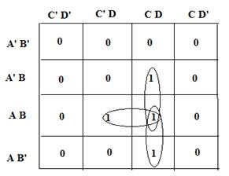
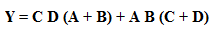
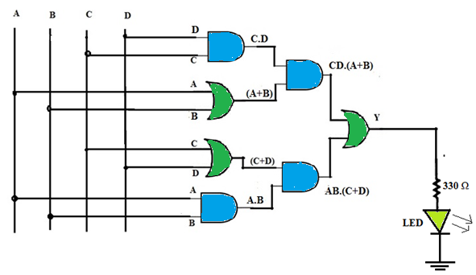

1 INTRODUCTION

 In many industrial processes, certain control actions such as turning on/off of power supply, valve, or a conveyor belt are taken on the basis of the status of the input parameters. Based on the input parameters such as temperature, pressure, volume, liquid level etc., the next control operation is decided; whether to continue or enter the wait state or activate other devices for the desired conditions to be met. Majority circuit is an application that controls the process when a majority of inputs are in a particular state (either HIGH or LOW).

1.1    APPLICATION: MAJORITY CIRCUIT

Consider the place of a board meeting. Let us design a gadget that decides whether a majority of board directors are in favour of a policy decision (YES) or not (NO). Once the board directors A, B, C & D press the input switch YES/NO, the majority circuit turns ON the GREEN LIGHT to indicate that *three or more than three* board directors are in favour of the policy.

1.2     CONCEPT

A circuit that turns ON a GREEN light when the majority of its inputs A, B, C and D are HIGH to indicate the majority.

The stepwise design is as given below:

1.  Prepare a truth table of four variables that produces a HIGH output when three or more than three inputs are high and write a Minterm equation that defines the circuit functionality. For a four-bit majority circuit, sixteen possible combinations of inputs are possible. Of which, inputs 0111, 1011, 1101, 1110 and 1111 contain a majority of 1's.
##### The Minterm expression for this four-bit majority circuit is Y = Σ m (7, 11, 13, 14, 15).  

2.  Transform the Minterm equation into a Karnaugh map to get a reduced Boolean expression for the circuit functionality. This reduces the gate count. Use all possible K-map simplification rules to group maximum adjacent 1's to form octets or quads or pairs or single.

 

The Karnaugh Map for Y = Σ m (7, 11, 13, 14, 15) is given below:  
  
3.     The reduced Boolean expression derived from the K - map is  

Y = ACD + BCD +ABC +ABD

Let τ represent the time delay of one gate.

Approach 1:

To implement this expression, we need four 3-input AND gates and one 4-input OR gate. This is a two-level logic that needs about 2 τ amount of time to produce the output.

Approach 2:

The equation can also be written as:  

  
  To implement this expression, three 2-input OR gates and four 2-input AND gates are required. This gives a three-level logic that needs about 3 τ amount of time to produce the output. But all these are two input gate ICs which are readily available as IC 74LS08 & IC 74LS32.  

  
Figure1. Four -Bit Majority Circuit

